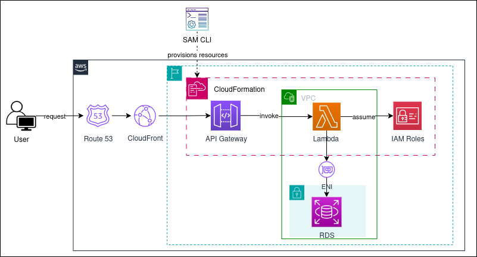
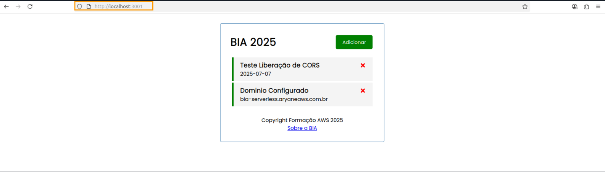
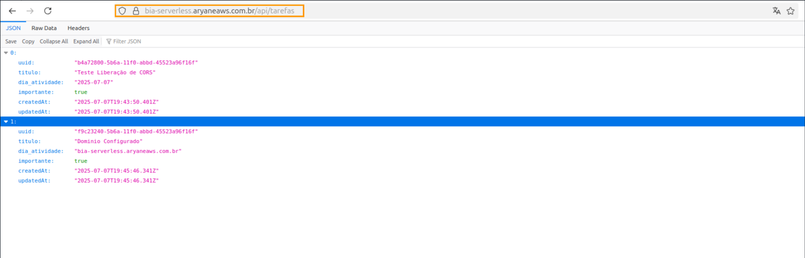
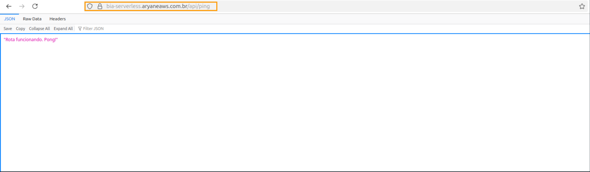
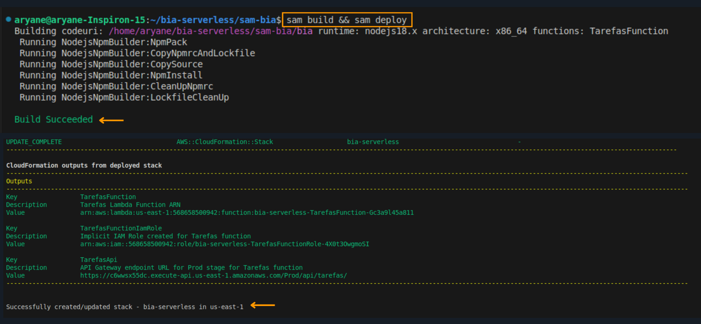
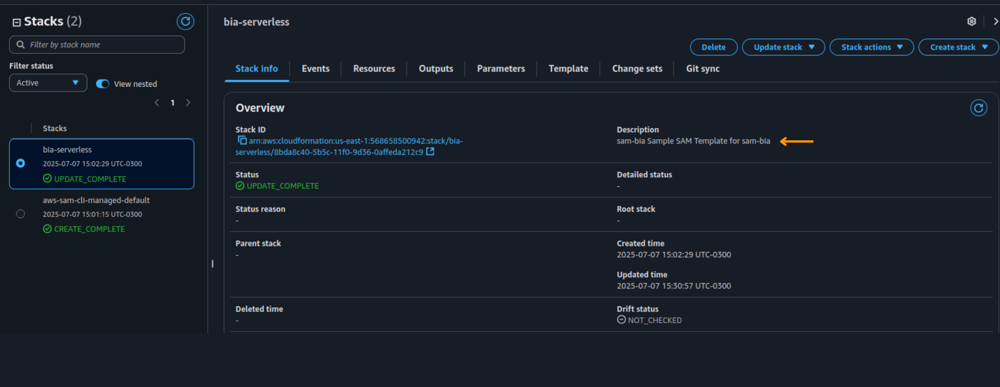
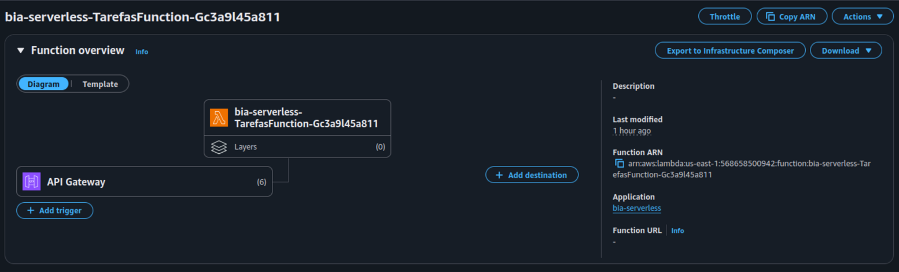
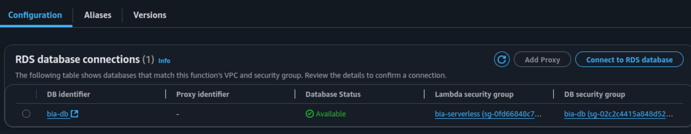
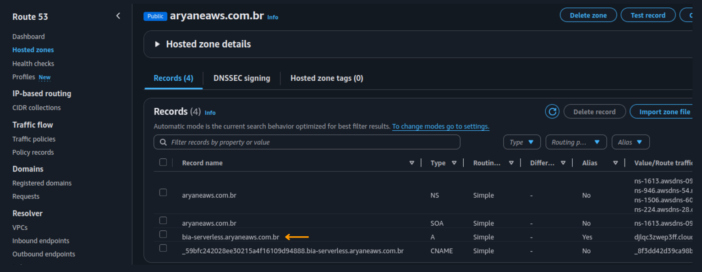
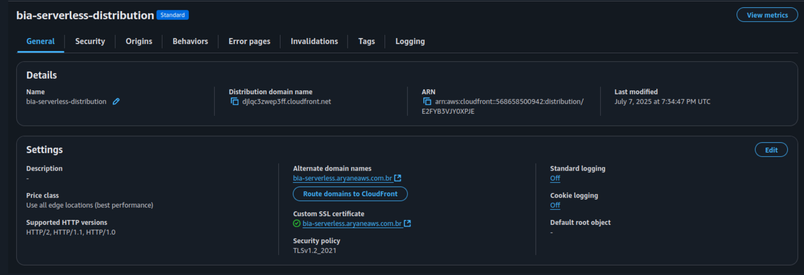

# 🧩 API Serverless com AWS SAM, Lambda, API Gateway e RDS


---

## 🧭 Arquitetura da Solução



Este projeto implementa uma API REST em arquitetura **100% serverless** na AWS. A solução é provisionada com AWS SAM e exposta via Amazon API Gateway. O backend é executado em funções AWS Lambda escritas em Node.js, integradas a um banco de dados PostgreSQL hospedado no Amazon RDS, em VPC privada.

---

## 📌 Objetivo

Realizar a migração de uma aplicação Node.js tradicional para uma arquitetura 100% serverless, utilizando os principais serviços da AWS para garantir escalabilidade, alta disponibilidade, segurança e provisionamento automatizado.

### Componentes da Solução:

- **AWS Lambda**: execução da lógica de negócio sem gerenciamento de servidores.
- **Amazon API Gateway**: gerenciamento e exposição dos endpoints HTTP.
- **Amazon RDS (PostgreSQL)**: persistência de dados com segurança em VPC privada.
- **AWS SAM**: modelagem da infraestrutura como código via `template.yml`.
- **CloudFormation**: criação automatizada da stack de infraestrutura.
- **CloudFront + Route 53**: configuração de domínio customizado e entrega de conteúdo com baixa latência.

---

## ⚙️ Tecnologias e Ferramentas

- **Node.js** (runtime das funções Lambda)
- **AWS SAM CLI**
- **Docker** (ambiente local para testes)
- **Amazon VPC (sub-redes privadas)**
- **IAM Roles e Policies**
- **Amazon Route 53 + SSL/TLS**
- **Amazon CloudFront (CDN)**

---

## 🔄 Ciclo de Desenvolvimento com SAM CLI

```bash
# Compilar os recursos definidos no template.yml
sam build

# Validar a definição da infraestrutura
sam validate

# Realizar o deploy com criação da stack no CloudFormation
sam deploy --guided
````

> O arquivo `template.yml` contém toda a definição da infraestrutura serverless, incluindo funções Lambda, API Gateway, permissões, variáveis de ambiente, integração com RDS e configurações de VPC.

---

## 📸 Capturas de Tela

### Execução e Testes Locais com SAM CLI em Ambiente Docker 



### Validação da API em Produção via Domínio Customizado



### Teste de Disponibilidade através da Rota /api/ping 



###  Deploy da aplicação com SAM CLI



### Stack criada no AWS CloudFormation



### Integração da API Gateway com a Função Lambda



### Integração Segura entre Lambda e Banco de Dados RDS



### Domínio customizado com Route 53 



### Distribuição Global com CloudFront e Otimização de Latência




---

## ✅ Resultados Técnicos

* Arquitetura serverless escalável e altamente disponível
* Automatização completa do provisionamento com AWS SAM + CloudFormation
* Integração segura com banco de dados em VPC privada
* API exposta com domínio personalizado e certificado SSL
* Redução de custos operacionais e eliminação de infraestrutura gerenciada

---

